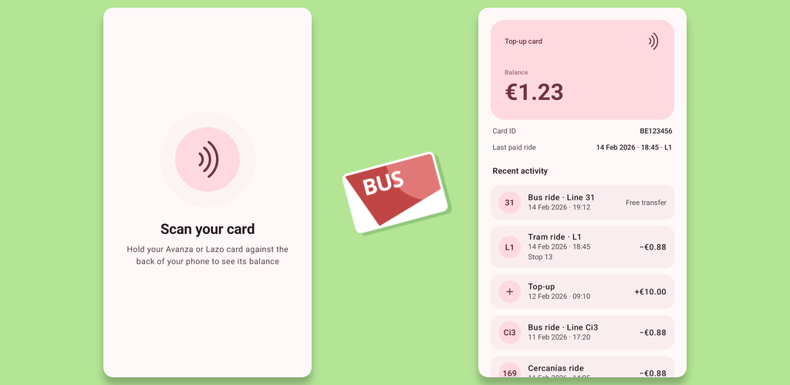

# Zaragoza Tarjeta Bus

Free Android app that reads your Zaragoza transport card and displays remaining balance in euros, recent trips and top-ups.

 

> [!IMPORTANT]
> ⚠️ **Aviso legal:** Este repositorio es un proyecto de investigación de seguridad independiente.  \
> No está destinado a cometer fraude ni a facilitar el uso indebido del transporte público. \
> No se proporcionará asistencia para ningún uso ilícito. \
> Consulta [LEGAL.md](./LEGAL.md) para el descargo de responsabilidad completo.

Based on reverse-engineered cards spec in [hloth/zgz-transport](https://git.hloth.dev/hloth/zgz-transport).

All releases are [reproducible](./REPRODUCIBILITY.md).

## License

[MIT](./LICENSE)

## Donate

[hloth.dev/donate](https://hloth.dev/donate)